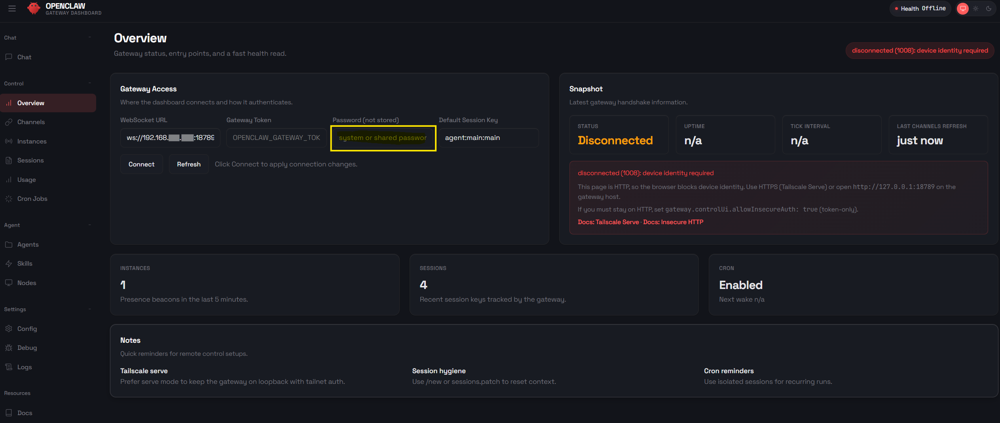

# <u> Extras - Funktionserweiterung - mehr Macht </u>

### Geheimnisse in die .env schreiben

<br>

---
### Wir bauen LLM Redundanz oder auch Fallback

<br>

---
### Gehe auf die "Dunkle Seite der Macht" Zugriff auf voll Root für den Bot

<br>

---
### <u> Die Gehirnwäsche, bereinigen des MEMORY </u>

Der Bot wird sein IDENTITY und seine SOUL und sein TOOL noch kennen!

Was wir bereinigen wollen ist, alles was sich OpenClaw selbst gemert und arschiviert hat. <br>
OpenClaw ist recht effektiv darin, z. B Chatverläufe zusammen zufassen und diese in einzelne Dateien zwischen zuspeichern. ODer wichtige Sachen die als solche identivieziert wurden und auch wenn wir dem Bot faktische Wahrheiten geben wie z. B. deine Server IP ist 192.168.178.xxx dann legt OpenClaw diese in die MEMORY.md ab.
<br>

Diesen Balst wollen wir jetzt loswerden, denn wir wollen bis auf den Namen und die Fähigkeiten neu anfangen. Was ist also zu tun?
<br>

Als erstes halten wir den Dienst an:

```bash
systemctl stop openclaw
```
Wir erinnern uns, wir haben den Agent von OpenClaw in einen Dienst gepackt und einen Autostart gebaut.

<br>

Löschen der Dateien und Verzeichnisse:
```bash
rm -rf /root/.openclaw/agents/main/sessions/*
```

```bash
rm -rf /root/.openclaw/workspace/memory/*
```

```bash
rm -f /root/.openclaw/memory/*.sqlite
```
Fertig! <br>
In der mein/sessions liegt das Kurzzeitgedächtnis hier werden die WhatsApp verläufe, oder die Verläufe aus den andern Messengern oder der Ui gepseichert.
<br>

Im workspace/ leigen unsere INDENTITY.md, die SOUL.md usw. die Dateien wurden nihct gelöscht. Aber es wurde nach einer MEMORY.md Datei geschaut (Langzeitgedächtnis) diese haben wir gerade entfernt.
<br>

OpenClaw arbeitet mit dem Dateiformat Markdown .md welches sehr gut Maschinenlesbar ist und dadurch sehr gut von LLMs verarbeitet werden kann. Weiter sind diese Art der Dateien sehr schnell und gut druchsuchbar. Was OpenClaw mit seiner internen Vektor-Suche zu gut kommt. Die Ergebnisse der Vektor-Suche und quasi der Index des Memorys werden in der main.sqlite geschrieben. Jetz passt der suchindex nihct mehr zu den gerade gelöschten Dateien, daher haben wir auch diese gelöscht.

<br>

**OpenClaw wacht jetzt aus seinem Lösch-Koma auf und kennt nur noch seinen Namen und sein Wesen, mehr nicht.** Ein guter Neuanfang ;-)

---
---
## *** Das OpenClaw Gateway Dashboard (Web-UI) ***

Da ich Openclaw in einem LXC - Container in einer quasi Isolierten Umgebung betreibe, möchte ich nicht permanent mit meinem Handy und dem Messenger (in meinem Fall WhatsApp) interagieren. die Gründe können vielfältig sein, aber meine Hauptgründe sind 1. ein kleines Display im Gegensatz zu meinem Monitor und 2. die virtuelle Handy - Tastatur im Gegensatz zu meiner richtigen PC-Tastatur.
<br> <br>
Was also tun? <br>
**Ich möchte gerne mit dem Webbrowser auf meinem PC arbeiten.**
<br> <br>
Also eine Web-Ui und eine Verbindung zum Agent. **auf gehts**
<br>
Ziel dieser Konfiguration ist es, das Dashboard im lokalen Netzwerk über den Browser aufzurufen und mit einem Passwort zu schützen.

---

**Schritt 1** - Anpassung der openclaw.json
<br>
Nun teilen wir dem Gateway mit, dass es den Passwort-Modus nutzen soll und erlauben den Zugriff über das lokale HTTP-Netzwerk.
<br> <br>
Durch "bind": "lan" wird das Gateway im gesamten Heimnetzwerk erreichbar.
Öffne die Datei ~/.openclaw/openclaw.json und passe den Block gateway wie folgt an:
<br> <br>

```bash
  "gateway": {
    "port": 18789,
    "mode": "local",
    "bind": "lan",
    "auth": {
      "mode": "password",
      "password": "${OPENCLAW_GATEWAY_PASSWORD}"
    },
    "controlUi": {
      "allowInsecureAuth": true
    },
    "tailscale": {
      "mode": "off",
      "resetOnExit": false
    }
  },
```

Hinweis zu allowInsecureAuth: Da wir im lokalen Heimnetzwerk oft kein SSL-Zertifikat (HTTPS) haben, muss dieser Wert auf true stehen, damit OpenClaw den Login über eine normale HTTP-Verbindung ohne vorheriges Device-Pairing erlaubt.

<br>

**"password": "${OPENCLAW_GATEWAY_PASSWORD}"** <br>
Hier wird wieder das Passwort in die .env ausgelagert.

<br>

Der Eintrag ist in der .env vorzunehmen, die Syntax steht in der example-env.md
```bash
# Mein eigenes Openlcaw Passwort
OPENCLAW_GATEWAY_PASSWORD=hier kommt das Passwort für das Gateway / Web-Ui rein (Geheimes-Passwort!123456)
```
<br>

[📝 Demo-Code ansehen: example-env.txt (inkl. Kommentare)](./.openclaw-adjusted/example-env.txt)

<br>

Jetzt kann unter der IP-Adresse von Openclaw und dem Port 18789 die Web-Ui zum chatten aufgerufen werden. <br>
Damit die Variablen neu eingelesen werden, starten wir den Dienst neu:

```bash
systemctl restart openclaw
```

Der Browser-Aufruf: Öffne an deinem PC den Webbrowser und navigiere zur IP-Adresse deines LXC-Containers, z. B.: http://192.168.xxx.xxx:18789
<br>
Beim ersten Aufruf gehe in das Menü Overview. Gib hier das oben vergebene Passwort ein. Ab sofort kannst du bequem vom Schreibtisch aus mit deinem ZeroLab-Agenten chatten!
<br>


Das in der .env hinterlegte Passwort wird jedesmal benötigt. Die Eingabe erfolg unter dem Menü-Punkt **"Overview"** siehe Bildschirmfoto:




---
## *** Der Voll-Zugriff im LXC Container ***

Jetzt machen wir uns an die Befreiung von OpenClaw aus seinem `.openclaw`-Gefängnis, ohne jedoch die **Sicherheit und Kontrolle** ganz über Board zu werfen. Da wir in einem LXC - Container arbeiten ist es
<br>
**jetzt angebracht ein BackUp vom LXC vorzunehmen.**

<br>

--------------------------------------------------------------------------------
## 🔓 <br> Schritt 2: Vollzugriff und Sandbox-Deaktivierung (Root-Rechte im LXC)

Standardmäßig führt OpenClaw sicherheitskritische Befehle in einer isolierten Docker-Sandbox aus (`sandbox.mode: "non-main"` oder `"all"`). Damit der Agent den LXC-Container (Host) als echter Admin (Root) verwalten, warten und konfigurieren kann, müssen wir diese Sandbox deaktivieren und die Berechtigungen für das Terminal-Werkzeug hochstufen.

---

### 💡 Exkurs: Architektur-Verständnis (System-Rechte vs. KI-Rechte)

Um zu verstehen, wie die Berechtigungen für ZeroLab funktionieren, muss man die strikte Trennung zwischen dem **Linux-Betriebssystem** und der **Applikation (OpenClaw)** kennen. Die Rechtevergabe erfolgt bei diesem Setup auf zwei Ebenen, die nahtlos ineinandergreifen müssen:

**1. Die System-Ebene (Das physische Fundament)**
Damit OpenClaw auf dem Host (dem LXC-Container) überhaupt systemweite Befehle ausführen *kann*, muss der Linux-Prozess selbst mit den entsprechenden Rechten laufen. Dies wurde bereits bei der initialen Basis-Installation des Daemons konfiguriert:
*   **Datei:** `/etc/systemd/system/openclaw.service`
*   **Einstellung:** `User=root`
*   **Wirkung:** Der Hintergrunddienst hat auf Betriebssystem-Ebene die physische Macht, alles auf dem LXC-Container zu verwalten.

**2. Die Applikations-Ebene (Die interne KI-Kontrolle)**
Obwohl der Prozess Linux-Root-Rechte besitzt, greifen standardmäßig die **internen Sicherheitsmechanismen** der Applikation, um zu verhindern, dass die KI diese Rechte versehentlich oder durch Prompt-Injection bösartig nutzt. 
*   **Datei:** `~/.openclaw/openclaw.json`
*   **Einstellung:** `sandbox.mode: "off"` und `tools.exec.security: "full"`
*   **Wirkung:** Erst diese Konfiguration entfesselt die KI. Wir erlauben dem Agenten *intern*, die Root-Rechte, die das Betriebssystem ihm bereithält, auch wirklich autonom und ohne ständige Nachfrage im Chat zu nutzen.

**Fazit:** Der System-Dienst reicht der KI das "Admin-Schwert" (Ebene 1), aber erst durch unsere JSON-Konfiguration (Ebene 2) erlauben wir ZeroLab, dieses Schwert auch selbstständig einzusetzen.

---

### 1. Anpassung der `openclaw.json`
Öffne die Datei `~/.openclaw/openclaw.json` auf dem LXC-Container. Wir müssen zwei entscheidende Sicherheitsmechanismen anpassen.

**A. Die Sandbox deaktivieren**
Suche den Block `"agents"` -> `"defaults"` und ändere den `"sandbox"`-Modus auf `"off"`. Dadurch läuft ZeroLab nicht mehr im isolierten Container, sondern direkt auf dem Ubuntu-Hostsystem.

```bash
  "agents": {
    "defaults": {
      "sandbox": {
        "mode": "off"
      },
      // ... restliche Agent-Einstellungen ...
    }
  },
```

**B. Terminal-Rechte (Exec Tools) freigeben** Füge einen neuen Block "tools" auf der obersten Ebene der JSON (z. B. unter dem agents-Block) ein. Hier heben wir die Whitelist-Prüfung für Befehle auf und schalten die Nachfrage ab.

```bash
  "tools": {
    "exec": {
      "security": "full",
      "ask": "off"
    }
  },
```  

**Erklärung der Parameter:** <br>

• "security": "full": Erlaubt das Ausführen aller Bash-Befehle auf dem Host, ohne dass diese vorher in einer Whitelist genehmigt werden müssen.

• "ask": "off": Schaltet die interaktive Nachfrage im Chat ab ("Darf ich diesen Befehl ausführen?"). Der Agent führt Befehle nun komplett autonom aus.

<br>

[⚙️ Demo-Code ansehen: openclaw.example.json (inkl. Kommentare)](./.openclaw-adjusted/openclaw.example.json)

<br>

**Neustart des Gateways** <br>
Damit OpenClaw aus dem "Gefängnis" entlassen wird und die neuen Rechte greifen, muss der Systemdienst neu gestartet werden:

```bash
systemctl restart openclaw
```

Ergebnis: Der Agent hat nun Vollzugriff auf das Linux-Dateisystem des LXC-Containers und agiert mit vollen Root-Rechten.

...
<br> <br> <br>

---
---
---


<br> <br>

...

Hier wird noch wild und unformatiert alles reingeworfen.

---

## *** Die Datenschleuder ***

---


**Hier sollten wir doch nochmal Hand anlegen bevor wir durchstarten.**

Wir machen die offenen perönslichen Daten und die Token, die im Klartext in der openclaw.json stehen erstmal sicher und legen eine DAtei für diese Variablen an.

<br> <br>

Die Datei hat den Namen .env und wirdd im Ordner .openclaw erstellt.
<br>
Die .env sollte wie folgt aussehen:

<br> 

**Beispiel .env** <br>
Komentare erwünscht ... <br>
Leerzeilen sind erlaubt und bringen Struktur ...

```bash
# --- SICHERHEIT & ZUGANG ---
# Das Token ersetzt den Eintrag in der json. So ist es nicht im Code sichtbar.
# OpenClaw Token vom den internen Agent.

OPENCLAW_GATEWAY_TOKEN=Hier-steht-der-Gateway-Token-von-OpenClaw

# --- NETZWERK ---
# Optional, aber sauber getrennt

# OPENCLAW_GATEWAY_PORT=18789
# OPENCLAW_GATEWAY_BIND=0.0.0.0

# --- PROVIDER CONFIG (Referenz) ---
# Konfiguration der einzelnen Provider und der API-Keys.
# Die Keys sind hier nur als Referenz eingetragen.

# API-Key von LM-Studio, Standard Key da es lokal auf meinem Multimedia-Server läuft.
# für eine spätere Integration als Offline-Modell
LM_STUDIO_KEY=lmstudio-local
LM_STUDIO_MODEL=llama2-70b-chat
LM_STUDIO_URL=http://192.168.178.xxx
LM_STUDIO_PORT=11434


# API-Key von Anthropic (Claude), Konto wurde mit 5$ Guthaben erstellt.
ANTHROPIC_API_KEY=Hier-steht-der-Anthropic-API-Key

# API-Key von Google Studio (Gemini) Basis Free Tier.
GOOGLE_API_KEY=Hier-steht-der-Google-API-Key


# --- HINWEIS ZUR TELEFONNUMMER ---
# OpenClaw benutzt aktuell KEINE direkte Umgebungsvariable von Listen (Arrays) 
# wie "allowFrom" in der JSON.
# STRATEGIE: Da die Nummer in der JSON bleiben muss, setze die Datei 
# 'openclaw.json' auf deine .gitignore Liste, damit sie niemals ver�ffentlicht wird!

# Variablen-Werte für die Telefonnummer
MY_PHONE_NUMBER=+49555Schuh


# Whatsapp Gruppen-IDs
# Gruppe -Name-
WHATSAPP_GROUP_xxxxx=12345678901234567890@g.us

# Weiter Keys oder Token und Geheimnisse in der gleichen Syntax

```

---
<br> <br>


## <u> Angepasste openclaw.json </u>
<br>


**Beispiel openclaw.json**<br>
Komentare erwünscht ..., geht auch hier mit // ... <br>
Leerzeilen sind erlaubt und bringen Struktur ...

```bash
// Hier gehts los, ein Kommentar und Leerzeilen sind erlaubt

{
  "messages": {
    "ackReactionScope": "group-mentions"
  },
  "models": {
    "providers": {
      "google": {
        "baseUrl": "https://generativelanguage.googleapis.com",
        "apiKey": "${GOOGLE_API_KEY}",
        "models": [
          {
            "id": "gemini-2.5-flash",
            "name": "Gemini 2.5 Flash",
            "contextWindow": 200000
          }
        ]
      }
    }
  },
  "agents": {
    "defaults": {
      "maxConcurrent": 4,
      "subagents": {
        "maxConcurrent": 8
      },
      "compaction": {
        "mode": "safeguard",
        "memoryFlush": { "enabled": true }
      },
      "workspace": "/root/.openclaw/workspace",

      "model": {
        // 1. Primäres LLM Google Gemini (kostenlos)
        "primary": "google/gemini-2.5-flash",
        
        // 2. Fallback auf Anthropic Claude, wenn Google das Limit erreicht (429)
        "fallbacks": [
          "anthropic/claude-sonnet-4-5"
        ]
      }
    }
  },
  "gateway": {
    "mode": "local",
    "auth": {
      "mode": "token",
      "token": "${OPENCLAW_GATEWAY_TOKEN}"
    },
    "port": 18789,
    "bind": "loopback",
    "tailscale": {
      "mode": "off",
      "resetOnExit": false
    },
    "nodes": {
      "denyCommands": [
        "camera.snap",
        "camera.clip",
        "screen.record",
        "calendar.add",
        "contacts.add",
        "reminders.add"
      ]
    }
  },
  "auth": {
    "profiles": {
      "google:default": {
        "provider": "google",
        "mode": "api_key"
      }
    }
  },
  "plugins": {
    "entries": {
      "whatsapp": {
        "enabled": true
      }
    }
  },
  "channels": {
    "whatsapp": {
      "selfChatMode": true,
      "dmPolicy": "allowlist",
      "allowFrom": [
        "${MY_PHONE_NUMBER}"
      ]
    }
  },
  "hooks": {
    "internal": {
      "enabled": true,
      "entries": {
        "boot-md": {
          "enabled": true
        },
        "command-logger": {
          "enabled": true
        },
        "session-memory": {
          "enabled": true
        }
      }
    }
  },
  "wizard": {
    "lastRunAt": "2026-02-13T17:24:12.522Z",
    "lastRunVersion": "2026.2.12",
    "lastRunCommand": "onboard",
    "lastRunMode": "local"
  },
  "meta": {
    "lastTouchedVersion": "2026.2.12",
    "lastTouchedAt": "2026-02-13T17:24:12.539Z"
  }
}
```

---

...